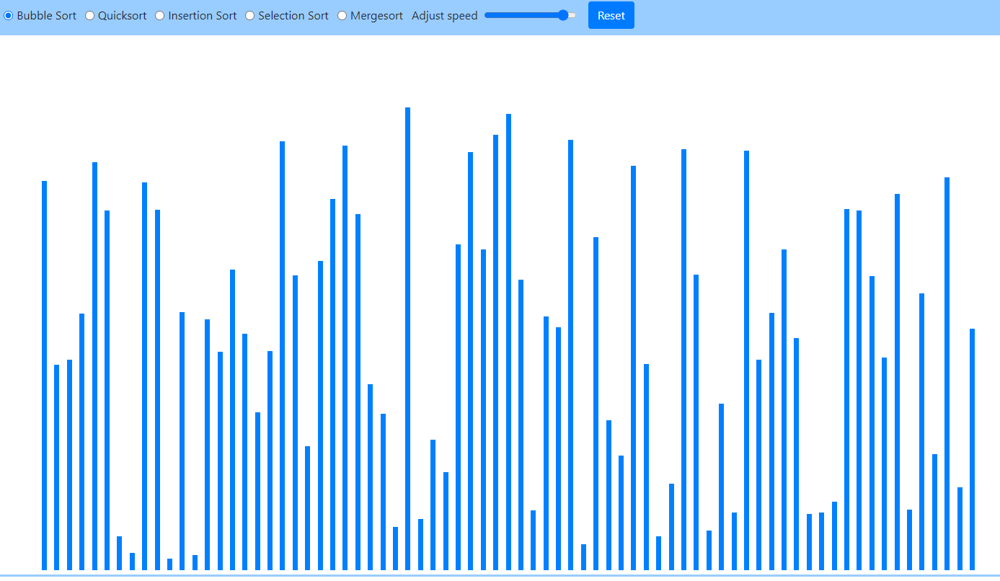

# Sorting Visualizer
See sorting algorithms work in real time! This visualizer has **bubble sort, quick sort, insertion sort, selection sort and merge sort** . Users can toggle the algorithm to use and the speed with a slider. Made with JavaScript, HTML and BootStrap. 

Here is a GIF of the project, but don't forget to check it out yourself at https://viktorbash.github.io/Sorting-Visualizer/

